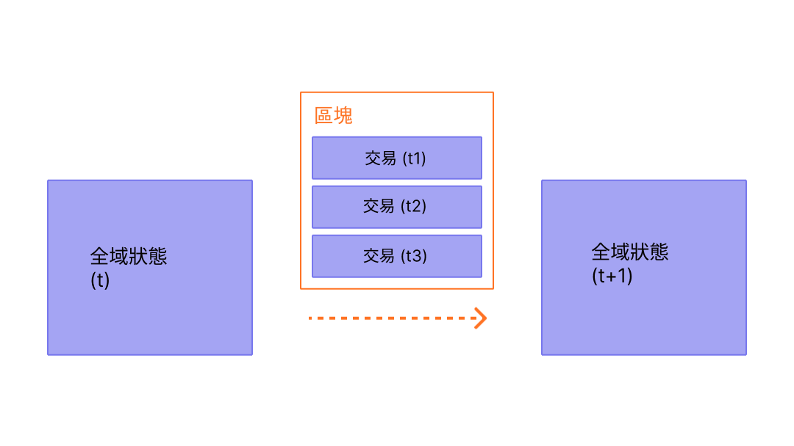

區塊為區塊鏈上擁有前一個區塊之雜湊值的交易批次。 透過這種方式，區域連結起來形成區塊鏈，因為雜湊值是透過加密方式從區塊資料中衍生得來的。 這樣就防止了假造，因為對歷史記錄中的任何區塊進行一處變更將會使其後的所有區塊無效，後面的所有雜湊值都會改變，並且所有運行區塊鏈的人都會注意到。

## 基本資訊 {#prerequisites}

區塊是一個非常簡單易懂的主題。 為了讓你更容易理解本頁，建議你先閱讀[帳戶](/developers/docs/accounts/)、[交易](/developers/docs/transactions/)及我們的[以太坊介紹](/developers/docs/intro-to-ethereum/)。

## 為何需要區塊? {#why-blocks}

為確保所有以太坊網路參與者擁有同步狀態並一致同意明確的交易歷史記錄，我們將交易分批打包成區塊。 此代表數十個（或數百個）交易將同時被提交、同意及同步。

 _此圖源於[以太坊EVM圖解](https://takenobu-hs.github.io/downloads/ethereum_evm_illustrated.pdf)_

透過將交易提交間隔分開，所有網路參與者能有足夠時間來達成共識：即便每秒有大量交易請求提出，但在以太坊上，僅以大約 12 秒的時間建立並提交一次區塊。

## 區塊如何運作? {#how-blocks-work}

為了保持交易歷史記錄，區塊嚴格按照順序排列（新建立區塊包含父區塊之參照），而區塊內的交易也是嚴格按照順序排列。 除極個別情形外，在任何給定時間點，所有網路參與者都一致同意區塊的準確數量及歷史記錄，並致力於將當前的即時交易請求批次打包到下一個區塊中。

當隨機挑選的驗證者在網路上生成一個區塊後，區塊將被廣播至全網路；所有節點將此新區塊添加於它們的區塊鏈尾端，接著，挑選一個新的驗證者來產生下一個區塊。 目前區塊生成、提交/共識流程是由以太坊之「權益證明」協議規定的。

## 權益證明協議 {#proof-of-work-protocol}

權益證明指的是：

- 驗證節點必須質押 32 個以太幣至存款合約，做為抵押品以避免惡意行為。 這會幫助保護網路，因為不誠信的活動一經證實會導致部分或全部質押被銷毀。
- 在每個時隙（12 秒間隔），會隨機挑選一位驗證者做為區塊的提交者。 他們將交易打包、執行並決定新的「狀態」。 他們將此資訊包裝進區塊並傳送給其他驗證者。
- 其他驗證者接到此新區塊後，重新執行這些交易，以確保他們同意新提交的全域狀態變更。 如果該區塊是有效的，他們將其加入自己的資料庫。
- 如果驗證者在同一時隙接到兩個衝突的區塊，他們會透過分叉選擇演算法選擇有最多質押以太幣支援的區塊。

[更多詳情關於質押證明(PoS)](/developers/docs/consensus-mechanisms/pos)

## 區塊中有什麼? {#block-anatomy}

區塊內有很多資訊。 在最高層級，區塊包含以下欄位：

| 欄位               | 描述             |
|:---------------- |:-------------- |
| `時隙`             | 區塊所屬的時隙        |
| `proposer_index` | 提出區塊的驗證者的識別碼   |
| `parent_root`    | 前一個區塊的雜湊值      |
| `state_root`     | 狀態物件的根雜湊值      |
| `主旨`             | 包含多個欄位的物件，定義如下 |

區塊的 `body` 包含以下幾個欄位：

| 欄位                   | 描述             |
|:-------------------- |:-------------- |
| `randao_reveal`      | 用於選擇下一個區塊提出者的值 |
| `eth1_data`          | 關於存款合約的資訊      |
| `塗鴉`                 | 用於標記區塊的任意資料    |
| `proposer_slashings` | 將被罰沒的驗證者清單     |
| `attester_slashings` | 將被罰沒的驗證者清單     |
| `證明`                 | 支持當前區塊的證明清單    |
| `存款`                 | 存款合約的新增存款清單    |
| `voluntary_exits`    | 離開網路的驗證者清單     |
| `sync_aggregate`     | 服務輕量用端的驗證者子集   |
| `execution_payload`  | 執行用户端傳送來的交易    |

`attestations` 欄位包含區塊中所有證明的清單。 每個證明都有自己的資料類型並包含一些資料。 每個證明包含：

| 欄位                 | 描述           |
|:------------------ |:------------ |
| `aggregation_bits` | 參與過此證明的驗證者清單 |
| `數據資料`             | 包含多個子欄位的容器   |
| `signature`        | 所有證明驗證者的聚合簽名 |

`attestation` 中的 `data` 欄位包含：

| 欄位                  | 描述              |
|:------------------- |:--------------- |
| `時隙`                | 與證明相關的時隙        |
| `索引`                | 證明驗證者的索引        |
| `beacon_block_root` | 包含此物件的信標區塊的根雜湊值 |
| `來源`                | 最後一個合法檢查點       |
| `target`            | 最新時期的邊界區塊       |

執行 `execution_payload` 中的交易會更新全域狀態。 所有用戶端都重新執行 `execution_payload` 中的交易，以確保新的狀態與新區塊中 `state_root` 欄位中的狀態相符。 這就是用戶端辨別新區塊是否有效並可以安全添加至其區塊鏈中的方式。 `execution payload` 自身是一個有許多欄位的物件。 還有一個 `execution_payload_header` 欄位，其中包含了關於執行資料的重要摘要資訊。 這些資料結構組織方式如下：

`xecution_payload_header` 包含以下欄位：

| 欄位                  | 描述                   |
|:------------------- |:-------------------- |
| `家長_雜湊值`            | 父區塊的雜湊值              |
| `fee_recipient`     | 用於支付交易費的帳戶地址         |
| `state_root`        | 在應用此區塊中的變更後全域狀態的根雜湊值 |
| `receipts_root`     | 交易收據樹的雜湊值            |
| `logs_bloom`        | 包含事件記錄的資料結構          |
| `prev_randao`       | 用於隨機選擇驗證者的值          |
| `block_number`      | 目前區塊號碼               |
| `gas_limit`         | 此區塊允許的最高燃料用量         |
| `gas_used`          | 此區塊實際消耗的燃料用量         |
| `時間戳`               | 區塊時間                 |
| `extra_data`        | 原始字節位元組格式的任意額外資料     |
| `base_fee_per_gas`  | 基本費用的值               |
| `block_hash`        | 執行區塊的雜湊值             |
| `transactions_root` | 有效負載中交易的根雜湊值         |
| `withdrawal_root`   | 有效負載中提款的根雜湊值         |

`execution_payload` 自身包含了以下欄位（請注意，這些欄位與標頭相同，只是它不包含交易的根雜湊值，而是包含實際的交易清單和提款資訊）：

| 欄位                 | 描述                   |
|:------------------ |:-------------------- |
| `家長_雜湊值`           | 父區塊的雜湊值              |
| `fee_recipient`    | 用於支付交易費的帳戶地址         |
| `state_root`       | 在應用此區塊中的變更後全域狀態的根雜湊值 |
| `receipts_root`    | 交易收據樹的雜湊值            |
| `logs_bloom`       | 包含事件記錄的資料結構          |
| `prev_randao`      | 用於隨機選擇驗證者的值          |
| `block_number`     | 目前區塊號碼               |
| `gas_limit`        | 此區塊允許的最高燃料用量         |
| `gas_used`         | 此區塊實際消耗的燃料用量         |
| `時間戳`              | 區塊時間                 |
| `extra_data`       | 原始字節位元組格式的任意額外資料     |
| `base_fee_per_gas` | 基本費用的值               |
| `block_hash`       | 執行區塊的雜湊值             |
| `交易（transactions）` | 要執行交易的清單             |
| `提款`               | 提款物件清單               |

`withdrawals` 清單包含 `withdrawals` 物件，具下列結構：

| 欄位               | 描述       |
|:---------------- |:-------- |
| `address`        | 已提款的帳戶地址 |
| `amount`         | 提款金額     |
| `索引`             | 提款索引值    |
| `validatorIndex` | 驗證者索引值   |

## 區塊時間 {#block-time}

區塊時間指的是分隔區塊的時間。 在以太坊上，時間被分割成 12 秒的單位，稱為「時隙」。 在每個時隙中，都會選擇一個驗證者來提交區塊。 假設所有驗證者都在線且功能完整，那每個時隙中都會有一個區塊，表示區塊時間為 12 秒。 然而，偶爾，當被要求提交區塊時驗證者可能下線，這表示時隙有時候會是空白的。

這種實作與基於工作量證明的系統不同，在工作量證明系統中，區塊時間是機率性的，並根據協議的目標挖礦難度調整。 以太坊的[平均區塊時間](https://etherscan.io/chart/blocktime)就是個完美的範例，可以透過一致性的 12 秒區塊時間清楚地推斷出，已經由工作量證明過渡到權益證明了。

## 區塊大小 {#block-size}

最後一個重要事項：區塊本身具大小限制。 每個區塊具 15M 單位燃料用量之目標大小，但區塊大小將跟隨網路需求增減，最大可達到 30M 燃料用量的區塊大小限制（目標區塊大小之兩倍）。 區塊中所有交易消耗的總燃料用量須少於區塊燃料限制。 這一點非常重要，因其確保區塊不能成為任意大小。 若區塊可以任意大，由於空間及速度方面的要求，那些效能一般的全節點可能逐漸跟不上網路。 區塊愈大，在下一個時隙中及時處理它們所需的算力就愈多。 這是一種中心化力量，可以透過限制區塊大小來抵制。

## 衍生閱讀 {#further-reading}

_認識社區或社團資源能幫助大家學習更多? 歡迎自由編輯或添加於本頁!!_

## 相關主題 {#related-topics}

- [交易](/developers/docs/transactions/)
- [燃料](/developers/docs/gas/)
- [權益證明(PoS)](/developers/docs/consensus-mechanisms/pos)
